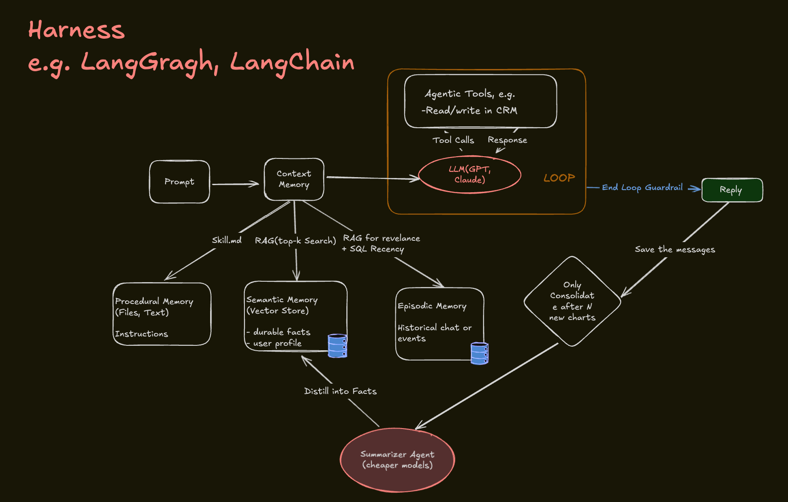

# Agent Harness and Engineering

This section contains an engineering-oriented sketch of how an AI agent system can be operated, evaluated, and improved.

## Preview

The diagram connects:

- prompts
- context memory
- procedural memory
- semantic memory
- episodic memory
- RAG
- summarizer agents
- tool calls
- loop guardrails
- deterministic code
- traces
- LLM-as-judge evals
- token, latency, and error observation
- release gates

## Files

- [`agent-harness-and-engineering.excalidraw`](agent-harness-and-engineering.excalidraw)
- [`agent-harness-and-engineering.png`](../../exports/png/agent-harness-and-engineering.png)

## Portfolio Framing

This is one of the strongest showcase diagrams in the sketchbook because it demonstrates system-level thinking beyond prompting. It shows how AI applications need memory, tools, observability, evaluation, and release discipline.

## Notes To Refine

- Fix spelling in the diagram: `LangGragh` to `LangGraph`, `revelance` to `relevance`, `Determinist` to `Deterministic`.
- Split the visual into two lanes if it becomes too dense: runtime loop and evaluation/release loop.
- Add a short companion note explaining how traces and eval gates help improve AI system quality over time.
