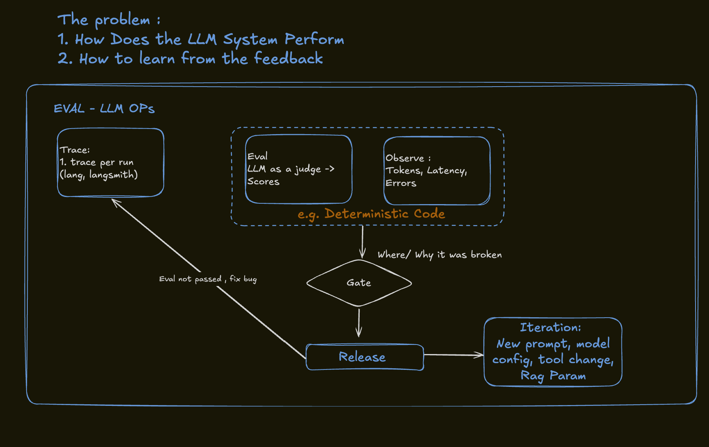

# LLM Evals and Observability

This section shows how an LLM system can be evaluated and improved after it is running.

## Preview

The sketch focuses on two core questions:

- How does the LLM system perform?
- How can the system learn from feedback?

## Concepts

- traces per run
- LLM-as-judge evaluation
- scoring
- token, latency, and error observation
- deterministic code around evaluation
- release gates
- debugging where and why a run broke
- iteration on prompts, model config, tools, and RAG parameters

## Files

- [`llm-evals-and-iteration-loop.png`](../../exports/png/llm-evals-and-iteration-loop.png)

## Portfolio Framing

This diagram complements the agent harness sketch. The harness explains how the system runs; this sketch explains how the system is measured, debugged, gated, released, and improved over time.
